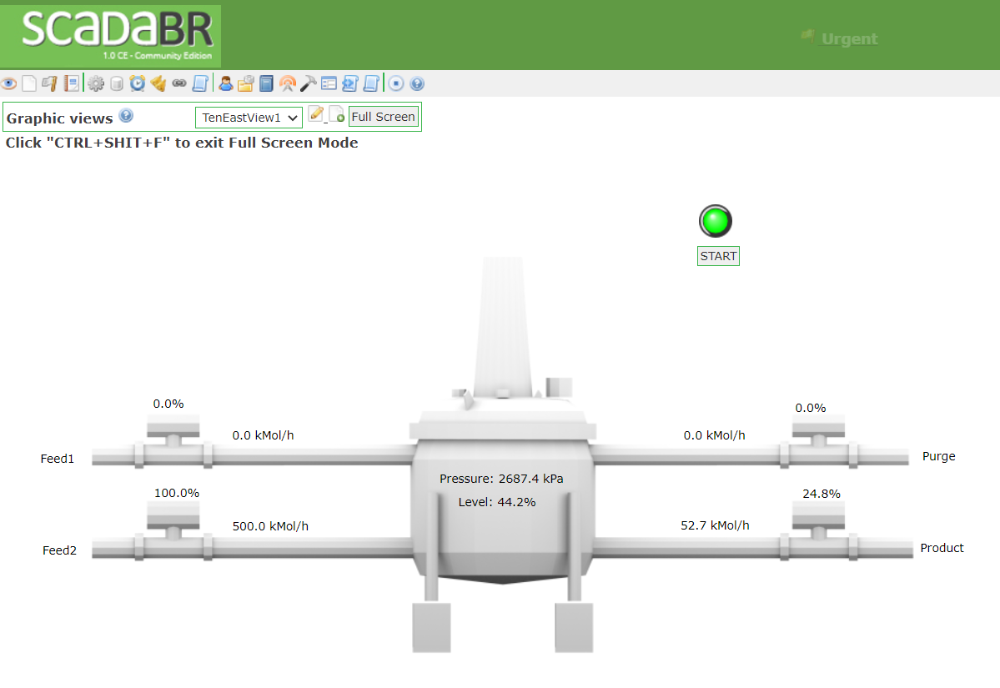
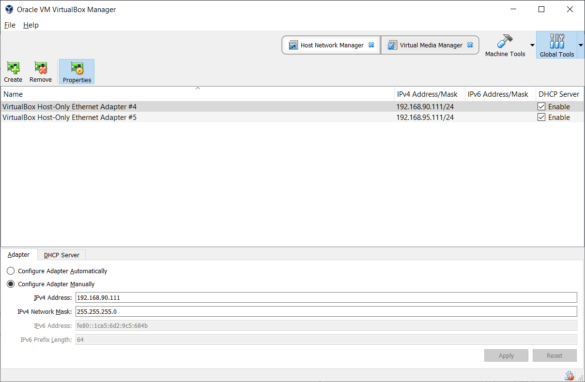

# GRFICSv2
Version 2 of the Graphical Realism Framework for Industrial Control Simulation (GRFICS)

### Overview

This version of GRFICS is organized as 4 VirtualBox VMs (a 3D simulation, a soft PLC, a HMI, and a pfsense firewall) communicating with each other on a host-only virtual networks. For a more detailed explanation of the entire framework and some background information on ICS networks, please refer to the workshop paper located at https://www.usenix.org/conference/ase18/presentation/formby

A commercial version of GRFICS with more scenarios, advanced features, and streamlined usability is being developed by Fortiphyd Logic. Find out more at https://www.fortiphyd.com/training

### Simulation

The simulation VM runs a realistic simulation of a chemical process reaction that is controlled and monitored by simulated remote IO devices through a simple JSON API. These remote IO devices are then monitored and controlled by the PLC VM using the Modbus protocol. This VM is located in the ICS network subnet (192.168.95.0/24) with the IP addresses 192.168.95.10-192.168.95.15

### Programmable Logic Controller

The PLC VM is a modified version of OpenPLC (https://github.com/thiagoralves/OpenPLC_v2) that uses an older version of the libmodbus library with known buffer overflow vulnerabilities. This VM is located in the ICS network subnet (192.168.95.0/24) at 192.168.95.2

### Human Machine Interface

The HMI VM primarily contains an operator HMI created using the free ScadaBR software. This HMI is used to monitor the process measurements being collected by the PLC and send commands to the PLC. NOTE: start/stop buttons and flow rate input have been removed temporarily because even benign user behavior would blow up the reactor. I am working to fix this. This VM is located in the DMZ network subnet (192.168.90.0/24) at 192.168.90.5

### PfSense Firewall/Router

The firewall VM provides routing and firewall features between the DMZ and ICS network. The WAN interface is on the DMZ subnet (192.168.90.0/24) at 192.168.90.100 and the LAN interface is on the ICS subnet (192.168.95.0/24) at 192.168.95.1

#### Installing from scratch

1. Download and install the latest version of [VirtualBox](https://www.virtualbox.org/wiki/Downloads).

2. [Create a host-only interface](https://www.virtualbox.org/manual/ch06.html#network_hostonly) in VirtualBox.

3. Download an image for both the desktop and server versions of 64-bit [Ubuntu 16.04](http://releases.ubuntu.com/16.04/).

4. See instructions for each VM in corresponding directories.

#### Pre-built VMs

1. Download VMs:

   - [Simulation VM](https://netorgft4230013-my.sharepoint.com/:u:/g/personal/dformby_fortiphyd_com/EaBeAxbF6xtEumdsJ7npVz0BeECJnseAMsfAbaLwV3sKOg?e=eocedW) - MD5=8712865585e96c87f84a158b3cc5ad32
   - [HMI VM](https://netorgft4230013-my.sharepoint.com/:u:/g/personal/dformby_fortiphyd_com/Eacy2_AyKsNHsebSady0fGMB95li29AVnQxjHiu89XXpEQ?e=WZxsx0) - MD5=411a95bf884c67d23d44674521671524
   - [pfsense VM](https://netorgft4230013-my.sharepoint.com/:u:/g/personal/dformby_fortiphyd_com/ETe9GfHNkOZKh2YuL7oMd1UBs8zhnqmGnqoODuTy2q8alg?e=GqTHB6) - MD5=521745220cd2f6e268eb188934d6b0ad
   - [PLC VM](https://netorgft4230013-my.sharepoint.com/:u:/g/personal/sbryce_fortiphyd_com/ETCyfk-Xfd1Gr9HBYAXT5ssBpuYS4PvTIy7-00ukCRI1EA?e=vMV63e)

2. [Add 2 host-only adapters](https://www.virtualbox.org/manual/ch06.html#network_hostonly) in VirtualBox:
    - VirtualBox Host-Only Ethernet Adapter #2: 192.168.95.111 and 255.255.255.0 netmask
    - VirtualBox Host-Only Ethernet Adapter #3: 192.168.90.111 and 255.255.255.0 netmask

  Your VirtualBox settings should look something like the below screenshot.

  

3. Import each VM into VirtualBox using File->Import Appliance

4. VM credentials
    - Simulation (Chemical Plant): simulation | Fortiphyd
    - HMI (ScadaBR): scadabr | scadabr    web console: admin | admin
    - Pfsense: admin | pfsense
    - PLC: user | password

5. Log into the simulation VM and open 2 terminals. In one, cd into the "simulation" directory and run `./simulation`. In the second terminal, cd into the "simulation/remote_io/modbus" directory and run `sudo bash run_all.sh`.

6. Log into plc VM, cd into the OpenPLC_v2 directory, and run "sudo nodejs server.js"

7. On the host machine, set your network connection manually. IP: 192.168.90.51 Netmask: 255.255.255.0 Gateway: 192.168.90.200. Then, point your internet browser to the ip address of the simulation VM (default 192.168.95.10) to view the visualization.
