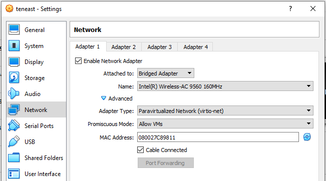

# GRFICSv2
Version 2 of the Graphical Realism Framework for Industrial Control Simulation (GRFICS)

#### Installing from scratch

1. Download and install the latest version of VirtualBox from https://www.virtualbox.org/wiki/Downloads

2. Create a host-only interface in VirtualBox (https://www.virtualbox.org/manual/ch06.html#network_hostonly)

3. Download an image for both the desktop and server versions of 64-bit Ubuntu 16.04 from http://releases.ubuntu.com/16.04/

4. See instructions for each VM in corresponding directories

#### Pre-built VMs

1. Download VMs:

Simulation VM:
https://netorgft4230013-my.sharepoint.com/:u:/g/personal/sbryce_fortiphyd_com/ESrivjs1EUFHn2UAfg7qDQ4BYL7IC31SKNsEHFHEAFmotA?e=2mNaSR

2. Add a host-only adapter in VirtualBox with IP address 192.168.95.1 and 255.255.255.0 netmask (https://www.virtualbox.org/manual/ch06.html#network_hostonly)
Your VirtualBox settings should look something like the below screenshots.

3. Import each VM into VirtualBox using File->Import Appliance

4. Every VM can be logged into with username "user" and password "password"

5. Log into the simulation VM and open 2 terminals. In one, cd into the "simulation" directory and run `./simulation`. In the second terminal, cd into the simulation/remote_io directory and run `sudo bash remote_io.sh`.

6. On the host machine, point your internet browser to the ip address of the simulation VM (default 192.168.95.10) to view the visualization.
